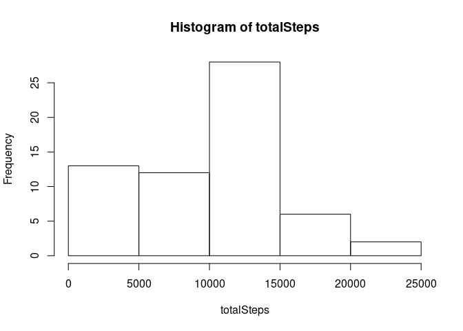
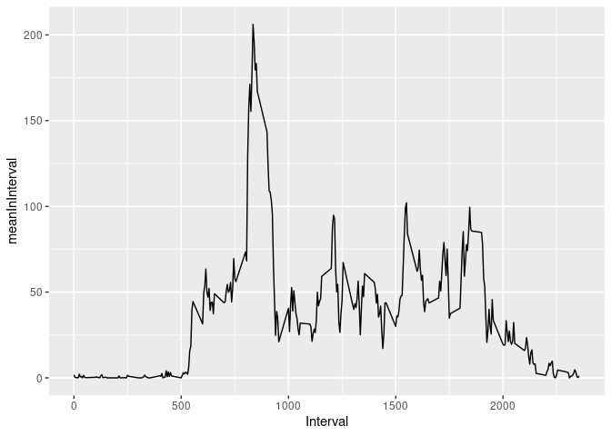
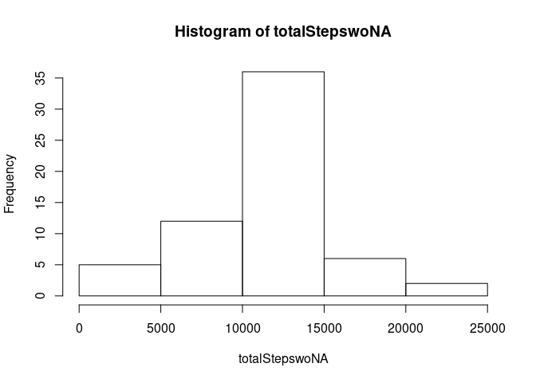
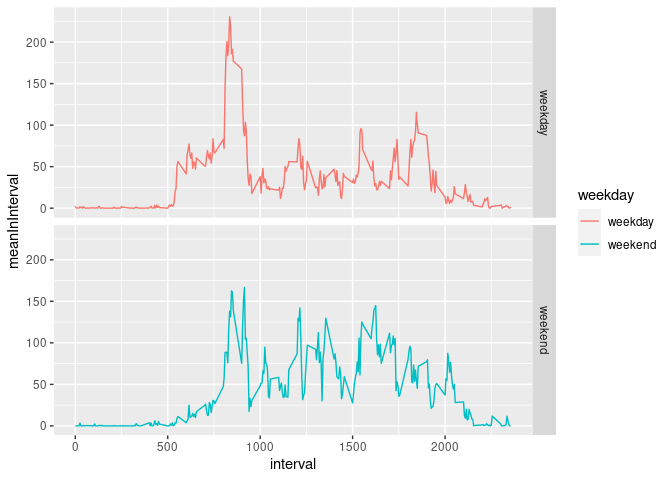

## Loading and preprocessing the data

```r
df <- read.table(file = unz("activity.zip", "activity.csv"), header=T, sep=",")
#View(df)
```


## What is mean total number of steps taken per day?

```r
library(dplyr)
```

```
## 
## Attaching package: 'dplyr'
```

```
## The following objects are masked from 'package:stats':
## 
##     filter, lag
```

```
## The following objects are masked from 'package:base':
## 
##     intersect, setdiff, setequal, union
```

```r
options(dplyr.summarise.inform=F)
dfTotal <- df %>%
    group_by(date) %>%
    summarise(totalperDay = sum(steps, na.rm = TRUE))

totalSteps <- dfTotal$totalperDay

hist(totalSteps)
```

<!-- -->

```r
meanSteps = mean(totalSteps, na.rm =TRUE)
print(paste("Mean of total steps per day ", meanSteps))
```

```
## [1] "Mean of total steps per day  9354.22950819672"
```

```r
medianSteps = median(totalSteps, na.rm =TRUE)
print(paste("Median of total steps per day ", medianSteps))
```

```
## [1] "Median of total steps per day  10395"
```


## What is the average daily activity pattern?


```r
library(ggplot2)
dfInterval<- df %>%
    group_by(interval) %>%
    summarise(meanInInterval = mean(steps, na.rm = TRUE),
              maxInInterval = max(steps, na.rm=TRUE))
#View(dfInterval)
 p <- ggplot(dfInterval, aes(x=interval, y=meanInInterval)) +
   geom_path() +
   xlab("Interval")
p
```

<!-- -->

```r
dfMax <- dfInterval[dfInterval$maxInInterval == max(dfInterval$maxInInterval),]
#View(dfMax)
print(paste("Max number of steps in interval", dfMax[, "interval"]))
```

```
## [1] "Max number of steps in interval 615"
```


## Imputing missing values

```r
print(paste("Total number of rows with NA ", sum(is.na(df))))
```

```
## [1] "Total number of rows with NA  2304"
```

```r
# use mean for interval for missing values
dfwoNA <- df %>%
    group_by(interval) %>%
    mutate(steps = ifelse(is.na(steps), round(mean(steps,na.rm=TRUE)), steps))
#View(dfwoNA)  

dfTotalwoNA <- dfwoNA %>%
    group_by(date) %>%
    summarise(totalperDay = sum(steps, na.rm = TRUE))

totalStepswoNA <- dfTotalwoNA$totalperDay

hist(totalStepswoNA)
```

<!-- -->

```r
meanStepswoNA = mean(totalStepswoNA, na.rm =TRUE)
print(paste("Mean of total steps per day ", meanStepswoNA))
```

```
## [1] "Mean of total steps per day  10765.6393442623"
```

```r
medianStepswoNA = median(totalStepswoNA, na.rm =TRUE)
print(paste("Median of total steps per day ", medianStepswoNA))
```

```
## [1] "Median of total steps per day  10762"
```


## Are there differences in activity patterns between weekdays and weekends?

```r
dfwe <- dfwoNA %>%
    mutate(day = weekdays(as.Date(date, format = "%Y-%m-%d"))) %>%
    mutate(weekday = ifelse((day == "Sonntag" | day=="Samstag"),"weekend","weekday"))

View(dfwe)

dfwe2 <- dfwe %>%
    group_by(weekday, interval) %>%
    summarise(meanInInterval = mean(steps))

View(dfwe2)

p1 <- ggplot(dfwe2, mapping = aes(x=interval, y=meanInInterval, colour = weekday)) +
    geom_line() +
    facet_grid(facets = weekday ~ .) 
p1
```

<!-- -->

